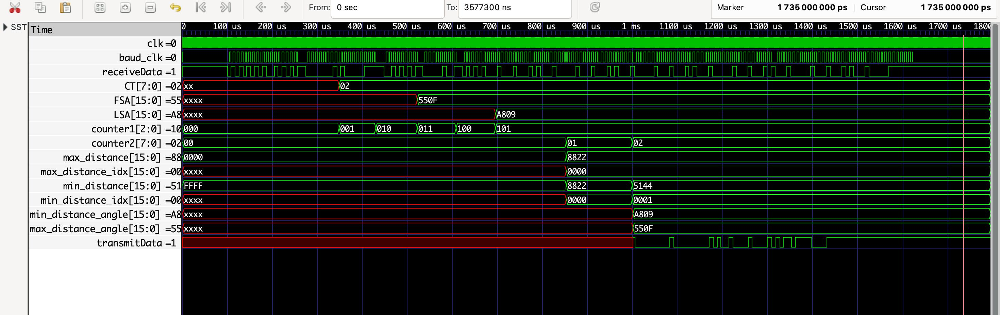
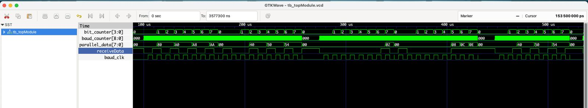
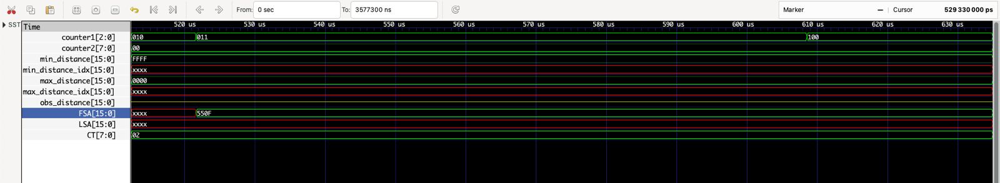
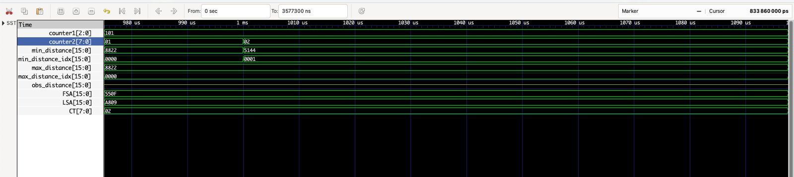
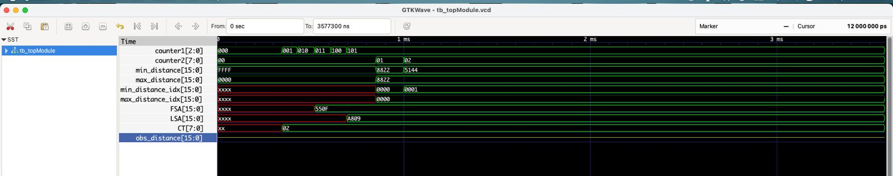
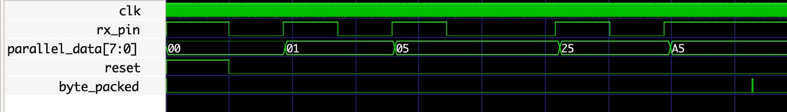

# UART based controller

We started the project by developing our 3 main modules i.e `RxD` , `distanceProcess` , `TxD`

`division` module was developed using restoring division algorithm.

`controlToTxD` module was made to serially arrange the data bytes to be sent
'TxD' converts easch byte into serial bits

`topmodule` includes the following

**RxD:**
---
+ ports: 
    + input ports:
        + *clk* - computer clk (standard i/p)
        + *reset* - again, standard input for resetting our module
        + *serial_input* - the data received from LiDAR 

    + output regs:
        + *parallel_data* - the asynchronous data converted to parallel byte
        + *byte_packed* - flag to signify that byte whether RxD is ready to read another byte or not. Also tells our distanceProcess to receive data
---
+ internal regs:
    + *state* - for defining FSMs
    + *bit_counter* - counter to regulate correct input of data
    + *baud_counter* - to set custom clock for receiving asynchronous signal
    + *startBaud* - flag to start baud clk once we receive start bit
    + *reset_internal* - flag to move to reset state once 8 bits read
    + *baud_clk* - custom clk set for reading certain baud rate ( in our case 115200 )
    + *delayOneMomentPliz* - leaves one clock cycle as a stop bit
---
+ Core Logic: 
    + IDLE is the default state.
    + We have an internal baud clk, but instead of always switching, it will only start once we see start bit. This makes sure we do encounter any "edge" case where we sample one data point twice or 0 times (since baud to clk ratio is decimal)
    + It uses a simple 8 bit reg, which is sequentially filled (sort of like a shift reg)
    + Once we sample 8 data points, we reset the receiver and push this data to the next module by making byte_packed as 1

**distanceProcess**
---
+ ports: 
    + input ports:
        + *data* - [7:0] - 8 BIT parallel input received from RxD
        + *clk* - processor clock
        + *rst* - resets all parameters inside the module
        + *takeData* - takeData tells us if we should interpret the data or not. Its turned to 1 if byte_packed is positive received from RxD MODULE

    + output regs:
        + *max_distance_angle/min_distance_angle* - 2 bytes updated data found from N sample data 
        + *obs_alert* - 2 bytes register which produces obstruction alert output when distance 10.24 cm 
        + *sendData* - flag that communicates with the next module when the data is ready
---
+ internal signals:

    + regs:
        + *headCheck* - 2 bit checker for header which comes in two parts 
        + *CT* - [7:0] - 1 byte register which desribes number of data samples which the LiDAR will be sending 
        + *FSA* - 2 byte data consisting of First Sample angle
        + *LSA* - 2 byte data consisting of Last Sample angle
        + *counter1* - 3 bit counter for sampling parallel input from **data**
        + *counter2* - 1 byte counter for keeping count of N sample data received from LiDAR. Used in finding min/max distance
        + *min_distance/max_distance* - 2 byte data which we finally find from N sample data pieces in order to find max/min angles
        + *AtHand* - 2 bytes reg defined in order to temporarily update the current values of data among N samples and update min/max accordingly
        + *min_distance_idx/max_distance_idx* - keeping update of index which contains max and min distances
        + *quo_rem_reg* - 3 bits reg maintaining states for divison algorithm
        + *rst_state* - resets our state if headcheck fails
        + *headerA* - part 1 for our header to check
        + *headerB* - part 2 for our header to check
        + *temp* - stores incoming parallel data as all other data comes in 2 byte pack so we have to concatenate 2 bytes individually
        + *obs_distance* - stores 16 bits which tells which index of sampled angle is less than safe distance
        + *divider_reset* - flag to tell division is good to go
        + *microCounter* - We will use this when interpreting data of 2N size
        + *numerator_min* - 4 byte reg which is assigned final value of numerator for finding min_distance_angle ___min_distance_idx*(LSA-FSA)___
        + *numerator_max* - 4 byte reg which is assigned final value of numerator for finding max_distance_angle ___max_distance_idx*(LSA-FSA)___
        + *clkDelayer* - waits 1 clk before starting the next part of the FSM to ensure we do not read on XXXX
        + *hipHop* - flag to mark completion of processing
        + *anotherClkDelayer* - waits 1 clk before starting the next part of the FSM to ensure we do not read on XXXX

    + wires:
        + *quo_min/quo_max* - 4 byte to store our resultant from division algorithm
        + *busy_min/busy_max* - for communicating with division module if its busy or idle
        + *division_done_min/division_done_max* - for communicating with modules when division is complete
        + *divider_reset_wire* - wire assigned divider_Reset value in order to communicate with division module
---
+ core logic : 
    + Firstly we must confirm that header matches. Till that is not true, the incoming bits are of no use, they're probably from some other sensor. Once we check the header we move forward.

    + Since the structure of bytes is very explicitly given, we can build from that that once header is observed, the next byte MUST be CT, then FSA (2 bytes), LSA(2 bytes), and then CT number of data points.
    
    + Once we have CT, just observe that many next data points. This is the next FSM state.
    
    + After receiving all expected data we will then use our divider circuit to find min and max_distance angle
    

**TxD**
---
+ ports:
    + input ports:
        + *clk* - system clock
        + *reset* - resets all register and FSMs
        + *byte_processed* - parallel input received
        + *receiveData* - 
        + *baud_clk* - custom clk developed to make synchronous data asynchronous according to baud rate

    + output regs:
        + *serial_output* - serial output in UART form
        + *sending_done* - flag to tell sending is complete
        + *busy* - flag to ensure control knows that the byte has not been sent yet. Note that sneding_done is not simply the inverse of this, it is more
        + *state* - define FSM states
        + *startTheSending* - flag to signal data is ready to be sent
---
+ internal regs:
    + *bit_counter* - maintains count of bits processed for serial output
---
+ core logic:
    + It is simply the reverse of RxD. We do nothing new here. The byte data is one by one sent on the internal baud clk.

**controlToTxD**
---
+ Input ports: 
    + *clk* – system clock  
    + *rst* – resets all registers and FSMs  
    + *sendData* – flag received from distanceProcess module to start transmission 
    + *min_distance_angle/max_distance_angle* – data received from controller to pass onto TxD 
    + *obs_alert* – again, data which has to be passed from controller to TxD

+ Output ports:
    + *serial_output* – UART serial output line  
    + *sendingDone* – flag indicating transmission complete  
    + *busy* – flag showing transmitter is active  

---
 
+ Registers: 
    + *steps* – 3 bit reg for defining states for FSM defined for sequentially giving parallel data to receiver in required order
    + *receiveData* – internally controls the signal(when to receive at RxD)  
    + *min_distance_angle_local/max_distance_angle_local* – local copy of `min_distance_angle` and `max_distance_angle` 
    + *obs_alert_local* – local copy of `obs_alert`  
    + *TxD_reset* – internal reset for TxD FSM
    + *byteAtHandReg* – holds the current byte being serialized  
    + *internalReset* – resets once all bytes are serialized
    + *baud_counter* – counter to generate baud clock  
    + *extraCounter* – prolly for adding one clock delay lol
    + *receiveDataWait* – wait flag for receiveData, goes LOW when receivedata is HIGH, signifies idle state of this module when High
    + *baud_clk* – custom clk developed to make synchronous data asynchronous according to baud rate

**division**
--- 

+ **Input ports:**  
    + *clk* – system clock  
    + *rst* – resets all registers and FSM  
    + *N* – 32-bit dividend  
    + *D* – 32-bit divisor  

+ **Output regs:**  
    + *quo* – 32-bit quotient result  
    + *busy* – flag indicating division is in progress  
    + *done* – flag indicating division has completed  

---

+ **Internal Registers:**
    + *counter* – 6-bit counter (to step through up to 32 cycles)  
    + *d* – 64-bit shifted divisor (aligned for restoring division)  
    + *r* – 64-bit partial remainder  

---
+ **core logic:**
    + This is restoring division. The main idea is that remainder and numerator are congruent with respect to the denominator. In radix 2, this is how it works:
    + Consider 2 regs d and r, which is twice the size of D and N. Also shift d by 32 bits (this will make sense soon)
    + Keep left shifting r until it is greater than d, once it is, then subtract it by d. Do this for all 32 bits
    + To fully understand this, consider base 10 division. Say we have 6265/0007. We take 6265/7000 first, see if we have a quotient. Since not, we now see 62650/7000 = 6265/700. Now we do have a quotient, 8 here. Subtract 7000*8 from 62650 = 6650. Now take 66500/7000 and repeat. We keep getting the next digit of the quotient. In the end, the remainder is left.

**topmodule**
--
+ **Input ports:**  
    + *receiveData* – input data signal to our RxD module 
    + *clk* – system clock  

+ **Output ports:**  

    **Receiver TB outputs**
    + *transmitData* – UART transmit line from our TxD module 
    + *reset* – global reset output  
    + *parallel_data* – 8-bit received parallel data  
    + *byte_packed* – flag indicating a full byte has been received  

    **Distance process TB outputs:**  
    + *headCheck* – 2-bit head-check flag  
    + *CT* – 8-bit cycle time / counter  
    + *min_distance_angle/max_distance_angle* – 16-bit minimum / maximum distance angle value    
    + *obs_alert* – 16-bit obstacle alert signal  
    + *sendData* – data send trigger  
    + *FSA*, *LSA* – 16-bit first/last scan angle values  
    + *counter1* – 3-bit counter 1  
    + *counter2* – 8-bit counter 2  
    + *min_distance* – 16-bit minimum distance value  
    + *max_distance* – 16-bit maximum distance value  
    + *AtHand* – 16-bit at-hand distance value  
    + *sendingDone* – indicates transmitter finished sending  

    **Transmitter TB outputs:**  
    + *steps* – 3-bit step counter  
    + *quo_rem_reg* – 3-bit quotient/remainder register (debug/utility)  
    + *busy* – indicates transmitter is active  
    + *min_distance_angle_local* – 16-bit local copy of min distance angle  
    + *receiveDataPliz* – secondary receive signal  
    + *TxD_reset* – reset for TxD block  
    + *state* – 2-bit FSM state  
    + *startTheSending* – flag to initiate sending  
    + *baud_clk* – baud rate clock for transmitter  

**Errors**
---
+ Data kept updating from previous edge: added clk delayers
+ Division algo did not work before: used restoring division the other way, right shifting denominator instead of left shifting numbertator. Did not work for some reason. We believe the reason was probably because of non blocking assignments, but then again we never found the root cause so we ended up switching algorithms ro left shifting numerator.
+ Division took too long: division was taking 100 clks ish (not a problem, but still too inefficient), so we reduced the number of states by half to make it more efficient by incorporating the next state updates in the if statements

+ distanceprocess took in whatever data was given to it: introduced byte_packed

+ TxD was made but wasn't working as wanted: we ended up hardcoding it a little instead of using shift regs

+ Old RxD was working improperly, because of baud clk mismatches

+ When integrating with topmodule, alot of new errors popped up, like how reset didn't work as we wanted it to. This caused a lot for problems for us and we had to add extra reset signals inside submodules and shift eeg assignments from reset to other variables like sendData. The most was observed in controlToTxD and TxD themselves.
We debugged using a lot of internal reg as output reg/wire which we finally concluded by finding the reset as a culprit. It was misperforming in many modules itself so we made internal_reset for each module.
The observed malfunctions were primarily attributed to signal connectivity issues across modules. In particular, certain variables either experienced misinteraction or between related modules, leading to inconsistent behavior in simulation. 

